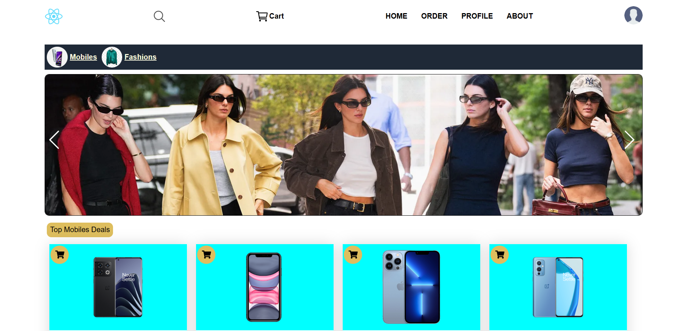
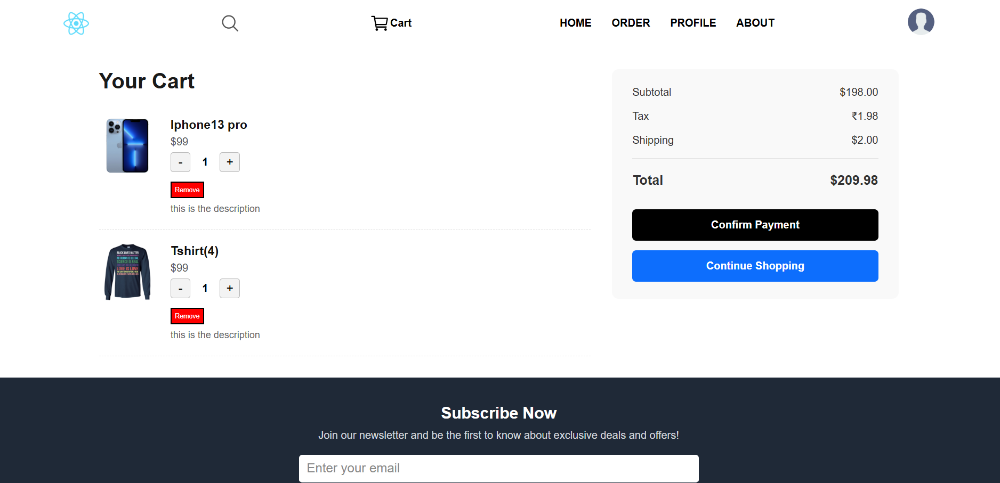

# 🛒 My E-commerce Website

A responsive, user-friendly e-commerce web application built with **React**, **Vite**, **Node.js**, and **MongoDB**.

## 🚀 Live Demo
👉 [Visit Site](https://ecommerce-mern-app-alpha.vercel.app)

## 📸 Screenshots

## 🔧 Features

- User Authentication (Signup/Login)
- Product Listings with Filtering & Search
- Add to Cart, Remove from Cart
- Persistent Cart 
- Order placement & deletion

## 🛠 Tech Stack

- **Frontend**: React, Vite, CSS
- **Backend**: Node.js, Express
- **Database**: MongoDB
- **State Management**: Redux 

